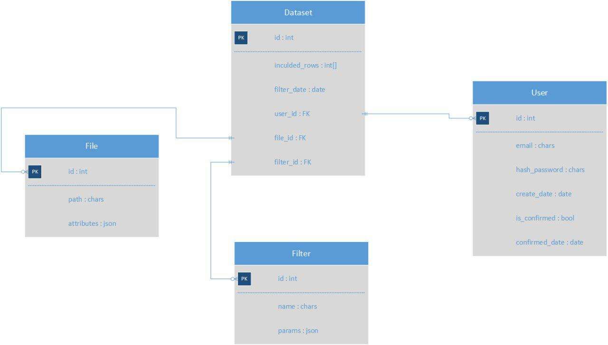

#Database structure

The database consists of four entities:  

1. <b>User</b> - entity which represents each registered user 
    * email - address of user which shall be correct and actual as user has to confirm registration with it.
    * hash_password - hashed representation of user password encrypted with SHA256.
    * create_date - date and time when user registered .
    * is_confirmed - boolean value which tells whether user confirmed registration or not, default value - false.
    * confirmed_date - date and time when user confirmed registration through email.

2. <b>File</b> - entity which represents each uploaded file on server 
    * path - string representation of relative path to file.
    * attributes - json with vital information about loaded file. This object includes such fields: original name of file, size of file in bytes, number of rows and columns, date file was uploaded.

3. <b>Filter</b> has information about created filter.
    * name - name of filter user enters before creating.
    * params - json with filter information

4. <b>Dataset</b> - main entity of the structure, which works as a bridge for all other entities 
    * included_rows - list of rows id's which were included in resulting data set after filtration. For every loaded file there will be created a dataset instance with this field as a null. 
    * filter_date - date and time when user make a request for filtration.
    * user_id - id of user who made a filtration or loaded file.
    * filter_id - id of used filter. Null if the dataset represents uploaded file and not filtering result.
    * file_id - id of file which is filtered. Null if the dataset represents uploaded file and not filtering result.