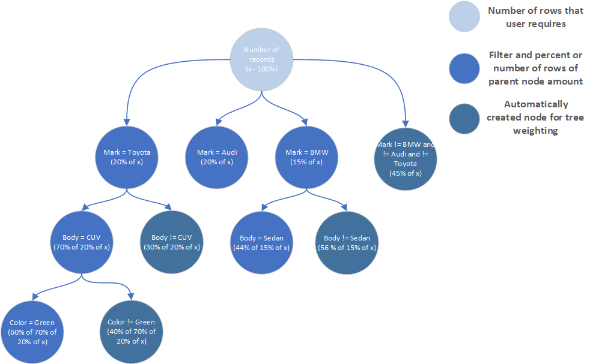

# Filter Tree

Each tree node is a new data set from a resulting set of a parent node if exists. number of rows to retrieve from file is calculated as a multiplication of original number of rows and each node percent value on the way from original to given.

For example, if user wanted to have as a result data set with a thousand records, number of Green CUV Toyotas would be equal to 1000x0.2x0.7x0.5=28.

